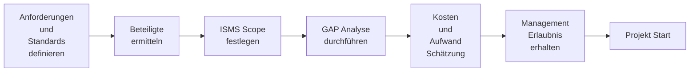
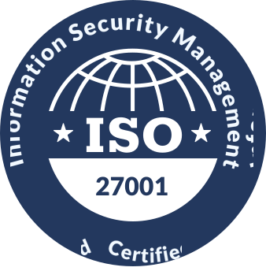
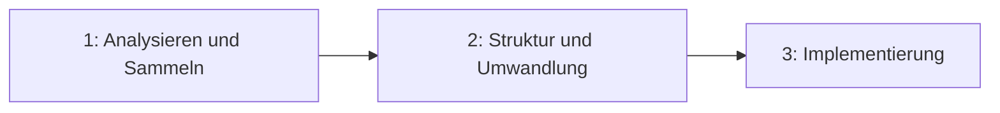
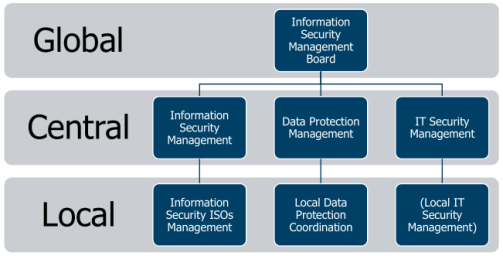
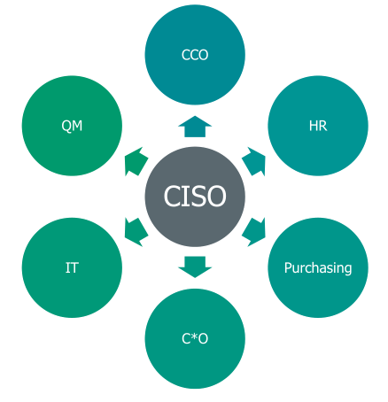
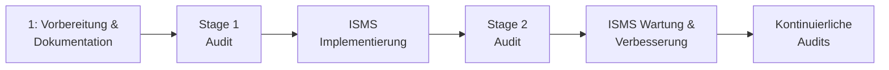

# IT-Recht Semester 4

# Inhaltsverzeichnis
- [IT-Recht Semester 4](#it-recht-semester-4)
- [Inhaltsverzeichnis](#inhaltsverzeichnis)
- [1 ISO Voraussetzungn, Policies, Organisation, Governance Model](#1-iso-voraussetzungn-policies-organisation-governance-model)
  - [Klassifizierung von Sicherheitsrisiken](#klassifizierung-von-sicherheitsrisiken)
  - [Schwächen](#schwächen)
    - [ISMS](#isms)
    - [Cyber Security](#cyber-security)
  - [Operational Excellence (OPEX)](#operational-excellence-opex)
  - [COBIT (Control Objectives for Information and Related Technology)](#cobit-control-objectives-for-information-and-related-technology)
  - [ISMS / Policies](#isms--policies)
    - [Einführung eines ISMS](#einführung-eines-isms)
  - [Standards](#standards)
  - [ISMS Scope festlegen](#isms-scope-festlegen)
  - [GAP Analyse](#gap-analyse)
  - [Informations Sicherheits Policies (ISO 27001, 5.2, A.5) :hammer:](#informations-sicherheits-policies-iso-27001-52-a5-hammer)
    - [5.2 Policy](#52-policy)
  - [Informations Sicherheits Policies (BSI 200-1, 7.1) :hammer:](#informations-sicherheits-policies-bsi-200-1-71-hammer)
  - [ISMS schematischer Aufbau](#isms-schematischer-aufbau)
  - [Zielsetzung, ISO27001, 6.2 :hammer:](#zielsetzung-iso27001-62-hammer)
  - [CIA Triade](#cia-triade)
  - [Informationssicherheit Schutzziele](#informationssicherheit-schutzziele)
  - [Informationssicherheits Prinzipien](#informationssicherheits-prinzipien)
  - [Organisation von Informationssicherheit (ISO 27001, 5.3) :hammer:](#organisation-von-informationssicherheit-iso-27001-53-hammer)
    - [5.3](#53)
  - [Organisation von Informationssicherheit (BSI 200, 7.2) :hammer:](#organisation-von-informationssicherheit-bsi-200-72-hammer)
    - [7.2](#72)
  - [Organisation von Informationssicherheit](#organisation-von-informationssicherheit)
  - [Information Security Management Board (ISMB)](#information-security-management-board-ismb)
  - [Chief Information Security Officer (CISO)](#chief-information-security-officer-ciso)
  - [ITIL](#itil)
    - [ITIL v3](#itil-v3)
      - [Prozesse:](#prozesse)
    - [ITIL v4](#itil-v4)
    - [Vergleich ITIL 4 im Vergleich zu ITIL 3](#vergleich-itil-4-im-vergleich-zu-itil-3)
  - [ISO20000](#iso20000)
- [2 Aktuelle Standards in der Informations Sicherheit](#2-aktuelle-standards-in-der-informations-sicherheit)
  - [Informationssicherheitsstandards](#informationssicherheitsstandards)
  - [KRITIS](#kritis)
  - [ISO 27001 Inhalte](#iso-27001-inhalte)
      - [ISO 27001 Zertifizierungsprozess](#iso-27001-zertifizierungsprozess)
  - [Kontinuierlicher Verbesserungsprozess](#kontinuierlicher-verbesserungsprozess)
  - [BSI Standards](#bsi-standards)
  - [NIST 800-53 Security and Privacy Controls for Information Systems and Organizations, Rev. 5](#nist-800-53-security-and-privacy-controls-for-information-systems-and-organizations-rev-5)
  - [NIST Cybersecurity Framework](#nist-cybersecurity-framework)
  - [Capability Maturity Model Integrated (CMMI)](#capability-maturity-model-integrated-cmmi)
  - [COBIT 2019](#cobit-2019)
    - [NIST CSF Implementierung mit COBIT 2019](#nist-csf-implementierung-mit-cobit-2019)
  - [VDA Information Security Assessment (VDA-ISA)](#vda-information-security-assessment-vda-isa)
  - [Human Resource Security (ISO 27001, 7.3, A.7) :hammer:](#human-resource-security-iso-27001-73-a7-hammer)
    - [7.1 Bewusstsein für Security Themen](#71-bewusstsein-für-security-themen)
  - [Human Resource Security (BSI200, 6) :hammer:](#human-resource-security-bsi200-6-hammer)
  - [Teleworking](#teleworking)
  - [Mitarbeiter Bewusstsein](#mitarbeiter-bewusstsein)
    - [Trainingsformate um Bewusstsein zu schaffen](#trainingsformate-um-bewusstsein-zu-schaffen)
- [3 Asset Management, Risk Management](#3-asset-management-risk-management)
- [4 EU-GDPR, BDSG + Internationales Datenschutz Recht](#4-eu-gdpr-bdsg--internationales-datenschutz-recht)
- [5 Rechtliche Lage Deutschland + International + Open Source](#5-rechtliche-lage-deutschland--international--open-source)
- [6 Zero Trust](#6-zero-trust)
  - [6.2 Business Continuity Management (BCM)](#62-business-continuity-management-bcm)
- [7 Workshop](#7-workshop)
- [8 Security by Design](#8-security-by-design)
  - [Standardisierter Einkaufswagen für IT-Equipment und Hardware Komponenten.](#standardisierter-einkaufswagen-für-it-equipment-und-hardware-komponenten)
  - [Strategien für Software](#strategien-für-software)
  - [Secure Coding Guidelines](#secure-coding-guidelines)

# 1 ISO Voraussetzungn, Policies, Organisation, Governance Model
Ist ISO eine IT Rolle?
> der ISO sollte innerhalb der IT-Abtielung positioniert sein. So ist eine effektive Zusammenarbeit mit der IT-Abteilung möglich

Was ist die Verbindung zwischen ISO und der Gesetzgebung?
> Der ISO hat die Aufgabe, rechtliche Rahmenbedingungen der Datenverarbeitung zu kontrollieren.

## Klassifizierung von Sicherheitsrisiken 

1. Niedrig: wenige Angriffe, keine Indikatoren für Eindringlinge oder Attacken
2. Gesichert: normales Risiko. Keine Indikatoren für Eindringlinge oder Attacken
3. Erhöht: Signifikantes Risiko: Mäßige Anzahl an Angriffen. Keine Anzeichen für Eindringlinge oder direkte Attacken
4. Hoch: hohes Risiko: hohe Anzahl an gemeldeten Angriffen. Keine Anzeichen für Eindringlinge oder direkte Attacken
5. Schwer: schweres Risiko. Anzeichen oder starker Verdacht für Eindringlinge

---

## Schwächen

### ISMS 
1. Fehlende oder unklare Anforderungen an InfoSec
2. Unklares InfoSec Vorgehensmodel
3. Fehlende Produkt- oder Service Lifecycle Orientierung :arrow_right: veraltete produkte und Services
4. Fokus nur auf technische Umsetzung :arrow_right: Prozesse hinter Technologien benötigt
5. Fehlende Standardisierung :arrow_right: führt zu unsicheren Architekturen, Lösungen und Software
6. Fehlende Notfall Planung :arrow_right: nicht zu bewältigendes Risiko

### Cyber Security
1. Schwachstellen in Software :arrow_right: nicht angemessen sicher genug für Gefahrenlage
2. Unangemessener Schutz gegen Maleware :arrow_right: geringe Erkennungsrate
3. Identifikation und Authentifizierung fehlend :arrow_right: Passwörter alleine sind nicht sicher genug
4. Unsichere Webseiten
5. Mobilgeräte Nutzung :arrow_right: Generierung zusätzlicher Angriffsvektoren (immer an, fehlende Updates, Nutzung unsicherer Netze)
6. E-Mail ist wie Postkarte :arrow_right: Phishing, Werbung, Viren, Social Engineering
7. Bezahlen mit persönlichen Daten :arrow_right: hohes Risiko für Privatsphäre
8. Fehlende Internet Kompetenz
9. Manipulierte Technologien
10. Fake News

---

## Operational Excellence (OPEX)
- Mindset der gewisse Prinzipien und Tools umfasst, um eine *Culture of Excellence* im Unternehmen einzuführen.
- Jeder Mitarbeiter kann den Wertefluss zum Kunden einsehen, dazu beitragen und ihn verbessern

Zielsetzung:

:arrow_right: Kernprozesse in der Wertschöpfungskette ständig im Hinblick auf Effektivität und Effizienz optimieren. Unterstützt durch die richtige Kombination der Verbesserungsmethoden den kontinuierlichen Verbesserungsprozess.

---

## COBIT (Control Objectives for Information and Related Technology)

International anerkanntes Framework zur IT-Governance und gliedert IT Aufgaben in Prozesse und Kontrollziele.

:arrow_right: Es wird definiert was umzusetzen ist, nicht wie es umzusetzen ist.

---

## ISMS / Policies

Schritte zur Einführung von ISO 27001:
1. Management Überzeugen
2. Verstehen wer in welcher Form betroffen ist. Prozesse und Dokumentationen benötigt
3. Vorbereitung von z.B. Risiko Analysen, Notfallplänen, Trainings
4. Implementierung des ISMS inklusive Prozesse und handhabung von Risiken
5. Überwachen und Überprüfen der Prozesse, Aktivitäten. Stage 1 Audit, Management Review und kontinuierliche Verbesserung/Anpassung
6. Zertifizierung. Stage 2 Audit, Management Überprüfung, kontinuierliche Verbesserung

### Einführung eines ISMS

---

## Standards

| Standard | Icon | Beschreibung |
| --- | --- | --- | 
| ISO 27001 |  | Internationale Norm für Einrichtung, Umsetzung, Aufrechterhaltung und fortlaufende Verbesserung eines dokumentierten Informationssicherheits-Managementsystems |
| TISAX |  | TISAX ist Kfz-Branchen-spezifisch. Der Standard betrifft die sichere Verarbeitung von Informationen von Geschäftspartnern, den Schutz von Prototypen und den Datenschutz gemäß Datenschutz-Grundverordnung (DSGVO) für mögliche Geschäfte zwischen Autoherstellern und ihren Dienstleistern oder Lieferanten |
| BSI Standard 200 |  | Erläutert den Aufbau eines Informationssicherheitsmanagementsystems (ISMS). Kompatibel zum ISO -Standard 27001 und berücksichtigt die Empfehlungen der anderen ISO -Standards wie ISO 27002 |
| KRITIS |  | Standard gültig für Betreiber kritischer Infrastrukturen. Umfasst 9 Sektoren der Kritischen Infrastruktur welche wichtige Bedeutung für das staatliche Gemeinwesen haben und  deren Ausfall oder Beeinträchtigung nachhaltig wirkende Versorgungsengpässe, erhebliche Störungen der öffentlichen Sicherheit oder andere dramatische Folgen haben würde. |
| IT Sicherheitsgesetz |  | Verbesserung der Sicherheit informationstechnischer Systeme (IT-Sicherheit) in Deutschland und Schutz kritischer Infrastrukturen, welche für das Funktionieren des Gemeinwesens relevant sind | 

---

## ISMS Scope festlegen
- Geographischer Scope
- Produktionsstandorte
- Organisationen
- Rollen
- Verfahren
- Prozesse

---

## GAP Analyse

Zeigt folgende Aspekte

- Status der implementierten Maßnahmen
- Verbesserungsbedarf
- Fehlende Implementierungen

Soll folgende Aspekte liefern:

- Aktueller Status
- benötigte Maßnahmen
- Benötigte Mittel: Zeit + Geld

---

## Informations Sicherheits Policies (ISO 27001, 5.2, A.5) :hammer:

### 5.2 Policy
Das Management soll eine Informationssicherheitsrichtlinie einführen, die:

<ol type="a">
  <li>dem Zweck der organisation angemessen ist</li>
  <li>IT Sec. Ziele beinhaltet oder ein Framework hierfür bereitstellt</li>
  <li>Verpflichtungen zur Einhaltung der geforderten Ziele beinhaltet</li>
  <li>Verpflichtungen zur kontinuierlichen Verbesserung des ISMS beinhaltet</li>
</ol>

Die Richtlinie sollte:
<ol type="a" start="5">
  <li>als Dokumentation vorhanden sein</li>
  <li>mit der Organisation kommuniziert sein</li>
  <li>interessierten Betroffenen zugänglich gemacht werden</li>
</ol>

---

## Informations Sicherheits Policies (BSI 200-1, 7.1) :hammer:

Formulierung sicherheitsrelevanter Ziele und einer Sicherheitsrichtlinie.

Die IT Sicherheitsziele sollten bei jedem Sicherheitsprozess festgelegt werden.

Folgende Aspekte sollten bei der Entwicklung der Sicherehits Strategie berücksichtigt werden:

- Ziele der Unternehmung oder Rolle der Behörde
- Rechtliche Anforderungen und Regulairen wie z.B. Datenschutz
- Kunden Anforderungen und existierende Verträge
- Interne Rahmenbedingungen
- IT gestützte Business Prozesse und Aufgaben
- Globale Bedrohungen und Gefahren durch Sicherheitsrisiken

---

## ISMS schematischer Aufbau

- Level 1-3 definieren Anforderungen
  - Policies
  - Prozeduren
  - Arbeitsanweisungen
- Level 4 enthält verschriftlichte Dokumente
  - Meeting Minutes
  - Dokumentationen (Trainings Nachweise)
  - Pentest Reports
  - Log Dateien

---

## Zielsetzung, ISO27001, 6.2 :hammer:

Die Organisation sollte IT Recht für ISOs Zielsetzungen an relevanter Funktion und Position einbringen.

Zielsetzungen sollen:

<ol type="a">
  <li>Konsistente zu Richtlinien sein</li>
  <li>Messbar sein</li>
  <li>Berücksichtigung der Anforderungen des geltenden IT-Rechts für ISOs und
die Ergebnisse der Risikobewertung und Risikobehandlung</li>
<li>Kommuniziert werden</li>
<li>Bei Bedarf angepasst werden</li>
</ol>

Grundsatz :arrow_right: Bei Bedarf sollten die High-Level Ziele zu spezifischeren Zielsetzungen heruntergebrochen werden.

---

## CIA Triade

Wichtigste IT Schutzziele:

- Vertraulichkeit: Daten sollten vertaulich verarbeitet werden und nur von autorisierten Nutzern eingesehen werden können. :arrow_right: Kompromitierungsbeispiel: Laptop geklaut, Passwort Diebstahl
- Integrität: Daten sollen korrekt und vollständig sein. Änderungen müssen nachvollzogen werden können. :arrow_right:  Kompromitierungsbeispiel: Ransomware → Die Daten werden verändert
- Verfügbarkeit: Informationstechnische Systeme müssen durchgängige Verfügbarkeit der Daten gewährleisten. Festlegung des Rahmens durch Unternehmen in Service-Level-Agreement. :arrow_right: DDoS Angriff

---

## Informationssicherheit Schutzziele
1. Informationen sind verfügbar, wenn sie benötigt werden
2. Vertrauliche Informationen müssen angemessen behandelt werden
3. Datenabfluss muss verhindert werden
4. Investitionen in IT, Operation und Know-How muss geschützt werden
5. Kosten bei eventuellem Schaden muss klein gehalten werden
6. Das Recht auf informationelle Selbstbestimmung muss gegeben sein
7. Einhaltung lokaler Richtlinien und Gesetze

---

## Informationssicherheits Prinzipien

1. CIA
2. InfoSec Franework nach ISO27001 ausgerichtet
3. Anpassung und Skalierung nach Bedarf
4. Klar definierte Verantwortlichkeiten
5. Vorhandensein des Bewussteins für InfoSec
6. Globale Sicherheits Richtlinien müssen umgesetzt werden
7. Vorfälle müssen sofort gemeldet werden
8. Regelmäßige Audits notwendig
9. Management muss Unterstützung zeigen und motivieren, Verbesserungsvorschläge einzureichen

---

## Organisation von Informationssicherheit (ISO 27001, 5.3) :hammer:

### 5.3
Führungsebene muss sicherstellen, dass Verantwortlichkeiten und Pflichten zugewiesen und kommuniziert sind.

Soll Verantwortlichkeiten zuweisen für:

<ol type="a">
  <li>Sicherstellung, dass InfoSec Anforderungen dieses internationalen Standards entspricht</li>
  <li>Berichterstattung über Performance der InfoSec an Führungsebene</li>
</ol>

---

## Organisation von Informationssicherheit (BSI 200, 7.2) :hammer:

### 7.2

Festlegen und Planung von  orga. Strukturen, Rollen und Pflichten.

Bei der Planung der Rollen, müssen folgende Regeln beachtet werden:

1. Die Verantwortung für InfoSec verbleibt in der Führungsebene
2. Es muss eine koordinierende Person geben (ISO)
3. Jeder Mitarbeiter ist für die Informationssicherheit an der eigenen Arbeitsstelle verantwortlich (beachten der do's and dont's in bezug auf InfoSec)

---

## Organisation von Informationssicherheit

1. 
   1. Was ist benötigt
   2. In welchem Kontext?
   3. in welcher Form?
2. 
   1. Ähnlichkeiten von Anforderungen
   2. Widersprüchlichkeiten von Anforderungen
   3. Wie passen Anforderungen in Struktur
3. 
   1. Einen Demand starten und abarbeiten
   2. Management Erlaubnis einholen
   3. Strukturen schaffen, Prozesse, Tools, Verwaltung
   4. Informieren und Trainieren von Leuten

---

## Information Security Management Board (ISMB)

---

## Chief Information Security Officer (CISO)

CISO interagiert mit allen relevanten Teilbereichen.

---

## ITIL

### ITIL v3

Ist die 3. Version der ITIL Service Operation und betrifft alle Aktivitäten und Maßnahmen zur Bereitstellung und Instandhaltung der IT-Infrastruktur, entsprechend ihrem Bestimmungszweck.

#### Prozesse:

- Request Fulfilment
  - Abbildung standardisierter Prozesse :arrow_right: Anlaufstelle für Anfragen, Beschwerden, ...
- Event management
  - Event ist Ereignis, das in IT ausgelöst wurde. Event muss zur Lösung an Servicedesk weitergeleitet werden
- Incident Management
  - Störungen werden nach vereinbarten Service Levels bearbeitet
- Problem Management 
  - Hier werden dem Incident-Management temporäre Lösungen (workarounds) zur Verfügung gestellt
  - befasst es sich mit der Störungsvermeidung (proaktives Management)

---

### ITIL v4

ITIL 4 bringt einige neue Gedanken ein und entwickelt bestehende Inhalte von ITIL v3 weiter. 

- ITIL 4 nennt zwei Schlüsselelemente:
- Service Value System SVS 7
- Modell der vier Dimensionen

Ganzeinheitlicher Ansatz für Management
- Organisation und Personen
- Informationen und Technologien
- Partner und Lieferanten
- Wertströme und Prozesse

---

### Vergleich ITIL 4 im Vergleich zu ITIL 3

- Continual Improvement: beide
- Identity und Access Management: beide
- Definition von Maßnahmen und Berichterstattungen: nur in ITIL 4

---

## ISO20000

- Internationaler Standard für IT Service Management
- Ursprünglich entwickelt, um Best-Practice Guidelines innerhalb ITIL aufzuzeigen

| Standard | Zertifizierung Unternehmen möglich | Zertifizierung Person möglich | Gültigkeit |
| --- | --- | --- | --- |  
| ISO/IEC 20000 | Ja | Nein | 3 Jahre |

---

# 2 Aktuelle Standards in der Informations Sicherheit

## Informationssicherheitsstandards
| Standard | Beschreibung |
| --- | --- |
| ISO27001 | ... |
| BSI 200 | ... | 
| NIST SP 800-53 | Zusätzliche Hintergrundinformationen, Gültigkeit, Implementierungshilfen, Bewertung |
| NIST Cybersecurity Framework | Freiwilliges Framework mit den Inhalten von Standards, Guidelines und Best-Practice Ansätzen zur Handhabung von Cyber Security Risiken |
| TISAX | Der Standard betrifft die sichere Verarbeitung von Informationen von Geschäftspartnern, den Schutz von Prototypen und den Datenschutz gemäß Datenschutz-Grundverordnung (DSGVO) für mögliche Geschäfte zwischen Autoherstellern und ihren Dienstleistern oder Lieferanten | 
| TPISR | PISR erfüllt damit eine ähnliche Rolle für US-Firmen wie TISAX in der deutschen Autoindustrie |

---

## KRITIS 

Organisationen und Einrichtungen mit wichtiger Bedeutung für das staatliche Gemeinwesen, bei deren Ausfall oder Beeinträchtigung nachhaltig wirkende Versorgungsengpässe, erhebliche Störungen der öffentlichen Sicherheit oder andere dramatische Folgen eintreten würden

Betroffene Unternehmen müssen:
- Kontakt mit Behörden führen
- IT Vorfälle melden
- State of the Art implementieren
- ISO27001 Nachweis alle 2 Jahre

---

## ISO 27001 Inhalte

Organisatorische und prozeduale Anforderungen

5. Richtlinien zur Informationssicherheit
6. Organisation der Informationssicherheit
7. Sicherheit der Humanressourcen
8. Vermögensverwaltung
9. Zugangskontrolle
10. Kryptographie
11. Physische und umgebungsbezogene Sicherheit 
12. Sicherheit im Betrieb 
13. Kommunikationssicherheit
14. Erwerb, Entwicklung und Wartung von Systemen
15. Lieferantenbeziehungen
16. Management von Informationssicherheitsvorfällen
17. Informationssicherheit des Business-Continuity-Managements
18. Einhaltung interner Anforderungen, z. B. Richtlinien, und externer Anforderungen, z. B. Gesetze

#### ISO 27001 Zertifizierungsprozess

---

## Kontinuierlicher Verbesserungsprozess

Plan, Do, Check, Act

---

## BSI Standards

| Standard | Inhalt |
| --- | --- |
| BSI-Standard 200-1 | ISMS | 
| BSI-Standard 200-2 | IT-Grundschutz-Methodik |
| BSI-Standard 200-3 | Risiko Analyse | 
| BSI-Standard 200-4 | Notfallmanagement |

---

## NIST 800-53 Security and Privacy Controls for Information Systems and Organizations, Rev. 5

- Gültigkeit bezieht sich auf alle Organisationen, nicht nur staatliche
- Anwendung in jeglicher Organisation oder System, das entweder Daten verarbeitet, speichert oder überträgt.
- soll Organisationen helfen, die Sicherheits- und Datenschutzkontrollen zu identifizieren, die zum Risikomanagement und zur Erfüllung der Sicherheits- und Datenschutzanforderungen Anforderungen

## NIST Cybersecurity Framework

- Identify: Entwicklung eines Verständnisses im Unternehmen um Cybersecurity Risiken zu bewältigen :arrow_right: Systeme, Menschen, Geräte, Daten
- Protect: Entwicklung und Implementierung angemessener Sicherheitsmaßnahmen
- Detect: Entwicklung und Implementierung angemessener Aktivitäten um Cybersecurity Vorfälle zu entdecken
- Respond: Entwicklung und Implementierung von Reaktionen auf entdeckte Risiken
- Recover: Entwicklung und Implementierung von Aktivitäten um mögliche Services wiederherzustellen

---

## Capability Maturity Model Integrated (CMMI)

ist ein Schulungs- und Beurteilungsprogramm für die Verbesserung von Prozessen

- Prozess Programm zum Training und Bewertung
- Für viele Regierungsaufträge benötigt
- CMMI definiert folgende Reife Level: Initial, Managed, Defined, Quantitatively Managed, and optimizing

---

## COBIT 2019

Werkzeug für das Management und die Steuerung der Unternehmens-IT.

COBIT dient als "Werkzeugkasten", um ein optimales Ausrichtung zwischen Business und IT herzustellen. Das Rahmenwerk unterstützt die Anwender beim Management der IT-Organisation und ist die Voraussetzung zur Umsetzung einer Corporate Governance.

### NIST CSF Implementierung mit COBIT 2019

1. Priorisierung und Scope festlegen. Business Ziele ermitteln und priorisieren. Mögliche verschiedene Anforderungen
2. Orientierung. Identifizierung relevanter Systeme, die von diesen Zielen betroffen sind
3. Erstellung Ist-Aufnahme
4. Risiko Management durchführen
5. Erstellung eines Ziel Profils
6. Vergleich Ist/Soll-Zustand
7. Umsetzung des Plans

---

## VDA Information Security Assessment (VDA-ISA)

- Selbsteinschätzung um den Stand der Informationssicherheit im Unternehmen festzustellen
- Auditierungen durch interne Abteilungen durchgeführt
- Selbstprüfung von ISO27001

---

## Human Resource Security (ISO 27001, 7.3, A.7) :hammer:

### 7.1 Bewusstsein für Security Themen

Personen die im Unternehmen arbeiten sollten bewusstsein für ... haben:
<ol type="a">
  <li>die InfoSec Richtlinien</li>
  <li>ihren Beitrag zu IT Sec Systemen und den vorteilen durch erhöhte Sicherheit</li>
  <li>Auswirkungen durch nicht konformes Vorgehen</li>
</ol>

---

## Human Resource Security (BSI200, 6) :hammer:
- Mitarbeiter müssen geschult/trainiert sein
- Vermittlung relevanter Aspekte
- Mitarbeiter müssen zur Einhaltung aller im Unternehmen relevanten Gesetze, Vorschriften und Regeleungen verpflichtet werden
- Müssen mit Informationssicherheit vertraut und motiviert sein
- Müssen wissen, welche Vorfälle zu melden sind

---

## Teleworking
- Off-Premises Benutzung
- Reisen
  - Parkplatz
  - Bahnhof
  - Flughafen
- Home Office
  - unauthorisierter Zugang
  - Sicht von Außen
  - Unbekannte Sicherheitssituation im privaten Wifi

---

## Mitarbeiter Bewusstsein

Warum?
- Anfälligkeit, schlechten Code nicht zu erkennen
- können Situationen evtl. nicht einschätzen
- Angst Fälle zu melden

### Trainingsformate um Bewusstsein zu schaffen

| Präventive Maßnahmen | Reaktive Maßnahmen / Tests |
| --- | --- |
| E-Learnings, Schulungen | Phishing Reporting |
| Helper Tools | Incident Prozess |
| Phishing Kampagnen | |
| Software aktuell halten | Daten wiederherstellen|
| Physikalischen Zugriff einschränken | Accounts entfernen |

Schwierigkeiten: 
- Fremde Sprachen
- Kulturelles Besonderheiten

# 3 Asset Management, Risk Management

# 4 EU-GDPR, BDSG + Internationales Datenschutz Recht

# 5 Rechtliche Lage Deutschland + International + Open Source

# 6 Zero Trust

## 6.2 Business Continuity Management (BCM)

Ziel: Im Rahmen eines Ausfalls Business am Laufen halten

Simulation: bei Ausfall von Systemen :arrow_right: Konsequenzen testen.

Festlegung der Ausfallzeiten in SLA.
Stark aus ISO9001 stellen Anforderungen an InfoSec Prozesse, obwohl sie Qualitätsnormen sind.

Incident Management (BSI 200)

ISO 22301, Sicherheit und Widerstandsfähigkeit

Notfallplan
1. Strategie, Ziele, Geltung
2. Sofortmaßnahmen: Melden, Alarmierung, Notfallstab
3. Vorsorge

Risiko Management Prozess

Risiko klassifizieren und einschätzen, wie hoch die ausfallwahrscheinlichkeit ist. Ermittlung Zielrisiko

Schadensausmaß :heavy_plus_sign: Eintrittshäufigkeit :heavy_plus_sign: Ist-Maßnahmen :heavy_plus_sign: Soll-Maßnahmen

# 7 Workshop

# 8 Security by Design

## Standardisierter Einkaufswagen für IT-Equipment und Hardware Komponenten.

Für alle dem Standard abweichenden Bestellungen muss Genehmigungsprozess inklusive Security durchgeführt werden.

Evtl. schwierig in Ländern wie China, wo Nutzung von [TPM Modulen](https://de.wikipedia.org/wiki/Trusted_Platform_Module) verboten ist.

## Strategien für Software

Universitäre Software und Lizenzen auf geschäftlichen Geräten verboten.

- Hauseigene Software
  - hohe Flexibilität
  - Pentest
- Outsourced entwickelte Software
  - Ähnliche wie hauseigene
  - Risiko und Kosten bleiben intern
- Maßschneidern von Software
- Software die dem Standard entspricht

## Secure Coding Guidelines
