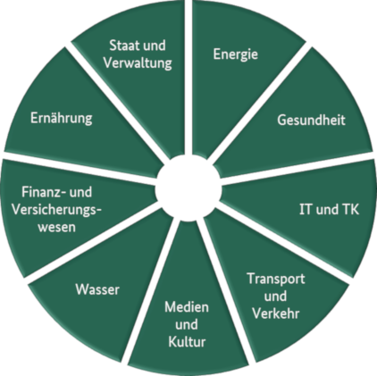
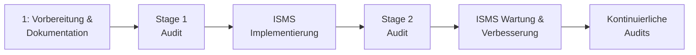
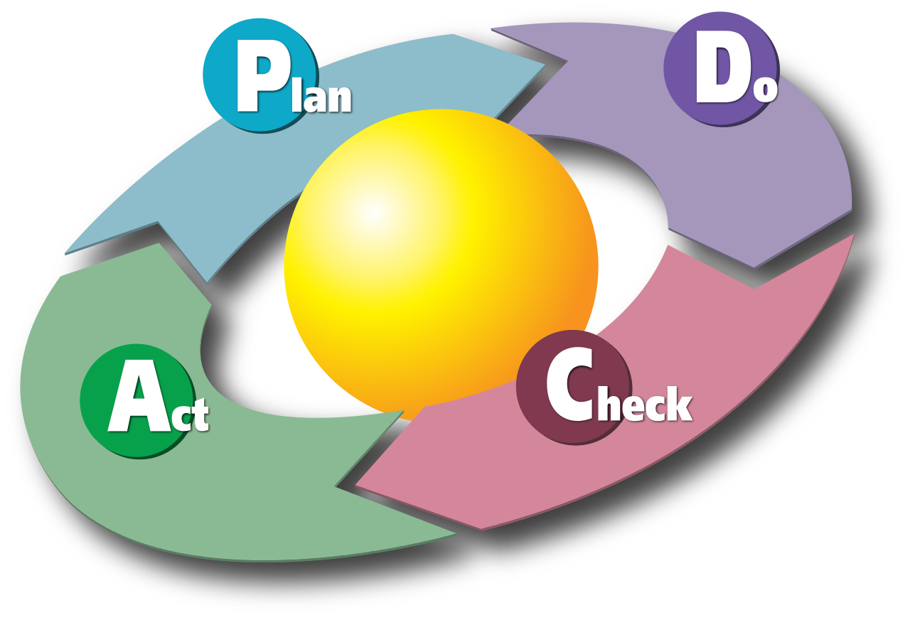
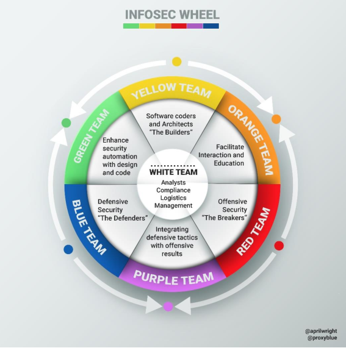
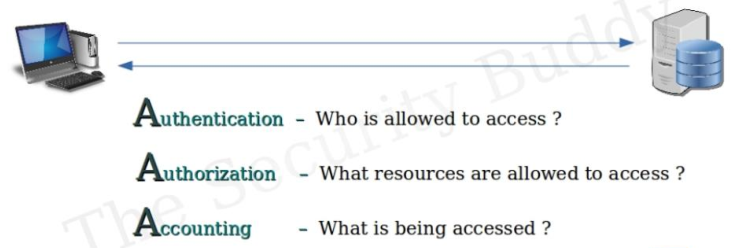

# 2 Aktuelle Standards in der Informations Sicherheit

## Informationssicherheitsstandards
| Standard | Beschreibung |
| --- | --- |
| ISO27001 | ... |
| BSI 200 | ... | 
| NIST SP 800-53 | Zusätzliche Hintergrundinformationen, Gültigkeit, Implementierungshilfen, Bewertung |
| NIST Cybersecurity Framework | Freiwilliges Framework mit den Inhalten von Standards, Guidelines und Best-Practice Ansätzen zur Handhabung von Cyber Security Risiken |
| TISAX | Der Standard betrifft die sichere Verarbeitung von Informationen von Geschäftspartnern, den Schutz von Prototypen und den Datenschutz gemäß Datenschutz-Grundverordnung (DSGVO) für mögliche Geschäfte zwischen Autoherstellern und ihren Dienstleistern oder Lieferanten | 
| TPISR | TPISR erfüllt damit eine ähnliche Rolle für US-Firmen wie TISAX in der deutschen Autoindustrie |

## KRITIS 

Organisationen und Einrichtungen mit wichtiger Bedeutung für das staatliche Gemeinwesen, bei deren Ausfall oder Beeinträchtigung nachhaltig wirkende Versorgungsengpässe, erhebliche Störungen der öffentlichen Sicherheit oder andere dramatische Folgen eintreten würden.

Betroffene Unternehmen müssen:
- Kontakt mit Behörden führen
- IT Vorfälle melden
- State of the Art implementieren
- ISO 27001 Nachweis alle 2 Jahre erbringen

## ISO 27001 Inhalte

Organisatorische und prozeduale Anforderungen

5. Richtlinien zur Informationssicherheit
6. Organisation der Informationssicherheit
7. Sicherheit der Humanressourcen
8. Vermögensverwaltung
9. Zugangskontrolle
10. Kryptographie
11. Physische und umgebungsbezogene Sicherheit 
12. Sicherheit im Betrieb 
13. Kommunikationssicherheit
14. Erwerb, Entwicklung und Wartung von Systemen
15. Lieferantenbeziehungen
16. Management von Informationssicherheitsvorfällen
17. Informationssicherheit des Business-Continuity-Managements
18. Einhaltung interner Anforderungen, z. B. Richtlinien, und externer Anforderungen, z. B. Gesetze

#### ISO 27001 Zertifizierungsprozess

## Kontinuierlicher Verbesserungsprozess

1. Plan (z.B. Einrichten eines ISMS)
2. Do (z. B. Implementieren und Verwalten von Ressourcen)
3. Check (Laufende Überwachung des ISMS und Erfolgskontrolle)
4. Act (Verbesserungen fließen ein)

## BSI Standards

| Standard | Inhalt |
| --- | --- |
| BSI-Standard 200-1 | ISMS | 
| BSI-Standard 200-2 | IT-Grundschutz-Methodik |
| BSI-Standard 200-3 | Risiko Analyse | 
| BSI-Standard 200-4 | Notfallmanagement |

## NIST 800-53 Security and Privacy Controls for Information Systems and Organizations, Rev. 5

- Gültigkeit bezieht sich auf alle Organisationen, nicht nur staatliche
- Anwendung in jeglicher Organisation oder System, das entweder Daten verarbeitet, speichert oder überträgt
- soll Organisationen helfen, die Sicherheits- und Datenschutzkontrollen zu identifizieren, die zum Risikomanagement und zur Erfüllung der Sicherheits- und Datenschutzanforderungen beitragen

## NIST Cybersecurity Framework

- Identify: Entwicklung eines Verständnisses im Unternehmen um Cybersecurity Risiken zu bewältigen :arrow_right: Systeme, Menschen, Geräte, Daten
- Protect: Entwicklung und Implementierung angemessener Sicherheitsmaßnahmen
- Detect: Entwicklung und Implementierung angemessener Aktivitäten um Cybersecurity Vorfälle zu entdecken
- Respond: Entwicklung und Implementierung von Reaktionen auf entdeckte Risiken
- Recover: Entwicklung und Implementierung von Aktivitäten um mögliche Services wiederherzustellen

## Capability Maturity Model Integrated (CMMI)

ist ein Schulungs- und Beurteilungsprogramm für die Verbesserung von Prozessen

- Prozess Programm zum Training und Bewertung
- Für viele Regierungsaufträge benötigt
- CMMI definiert folgende Reife Level: Initial, Managed, Defined, Quantitatively Managed, and optimizing

## COBIT 2019

Werkzeug für das Management und die Steuerung der Unternehmens-IT.

COBIT dient als "Werkzeugkasten", um ein optimales Ausrichtung zwischen Business und IT herzustellen. Das Rahmenwerk unterstützt die Anwender beim Management der IT-Organisation und ist die Voraussetzung zur Umsetzung einer Corporate Governance.

### NIST CSF Implementierung mit COBIT 2019

1. Priorisierung und Scope festlegen. Business Ziele ermitteln und priorisieren. Mögliche verschiedene Anforderungen
2. Orientierung. Identifizierung relevanter Systeme, die von diesen Zielen betroffen sind
3. Erstellung Ist-Aufnahme
4. Risiko Management durchführen
5. Erstellung eines Ziel Profils
6. Vergleich Ist/Soll-Zustand
7. Umsetzung des Plans

## VDA Information Security Assessment (VDA-ISA)

- Selbsteinschätzung um den Stand der Informationssicherheit im Unternehmen festzustellen
- Auditierungen durch interne Abteilungen durchgeführt
- Selbstprüfung von ISO27001

## Human Resource Security (ISO 27001, 7.3, A.7) :hammer:

### 7.1 Bewusstsein für Security Themen

Personen die im Unternehmen arbeiten sollten bewusstsein für ... haben:
<ol type="a">
  <li>die InfoSec Richtlinien</li>
  <li>ihren Beitrag zu IT Sec Systemen und den Vorteilen durch erhöhte Sicherheit</li>
  <li>Auswirkungen durch nicht konformes Vorgehen</li>
</ol>

## Human Resource Security (BSI200, 6) :hammer:

- Mitarbeiter müssen geschult/trainiert sein
- Vermittlung relevanter InfoSec Aspekte
- Mitarbeiter müssen zur Einhaltung aller im Unternehmen relevanten Gesetze, Vorschriften und Regeleungen verpflichtet werden
- Müssen mit Informationssicherheit vertraut und motiviert sein
- Müssen wissen, welche Vorfälle zu melden sind

## Teleworking

Ist eine Arbeitsorganisation, bei der Arbeitnehmer ihre Arbeitsaufgaben ganz oder teilweise außerhalb der Geschäftsräume oder Betriebsstätten des Arbeitgebers ausüben.

Formen und dadurch entstehende Risiken:

- Off-Premises Benutzung
- Reisen
  - Parkplatz
  - Bahnhof
  - Flughafen
- Home Office
  - unauthorisierter Zugang
  - Sicht von Außen
  - Unbekannte Sicherheitssituation im privaten Wifi (Verwendung von harmful Devices)

## Mitarbeiter Bewusstsein

Warum?
- Anfälligkeit, schlechten Code nicht zu erkennen
- können Situationen evtl. nicht einschätzen
- Angst Fälle zu melden

### Trainingsformate um Bewusstsein zu schaffen

| Präventive Maßnahmen | Reaktive Maßnahmen / Tests |
| --- | --- |
| E-Learnings, Schulungen | Phishing Reporting |
| Helper Tools | Incident Prozess |
| Phishing Kampagnen | |
| Software aktuell halten | Daten wiederherstellen|
| Physikalischen Zugriff einschränken | Accounts entfernen |

Schwierigkeiten:

- Fremde Sprachen
- Kulturelles Besonderheiten

## Simulationen

### Red Team Event

Red Team ist eine Gruppe von White-Heads die versucht, die Infrastruktur eines Unternehmens anzugreifen (Blue Team). 

Vorteile: Gibt eine gute Übersicht über die Robustheit der Sicherheitsmaßnahmen unter realistischen Bedingungen

## ISO 27001, A.9

### 9.1 Access Control

Ziel: Zugriff auf Informationen und verarbeitende Einrichtungen limitieren

### 9.2 User Access Management

Ziel: Sicherstellen, dass nur autorisierte Benutzer Zugriff auf Systeme und Services haben

### 9.3 User Responsibilities

Ziel: Benutzer dafür verantwortlich machen, dass sie ihre Zugangsdaten sicher verwahren

### 9.4 System and Application Access Control

Ziel: Unautorisierten Zugriff auf Systeme und Anwendungen unterbinden

## Zutritt, Zugang, Zugriff (Access)

- Physical Access (Zutritt) :arrow_right: Physische Kontrolle
- Logical Access (Zugang) :arrow_right: Authentisierung
- Content Access (Zugriff) :arrow_right: Autorisierung

## Triple A (AAA)

## Privileged User Management

- Separierter Admin Account
- Regelmäßige Kontrolle, ob Rechte noch benötigt werden
- Prozess beim Verlassen des Unternehmens muss definiert und eingehalten werden

## Identity Access Management

- Password Policy benötigt
- Mindestanforderungen

| Account | Länge | Ablaufen |
| --- | --- | --- | 
| User | 8-14 | 90 |
| User (alternate controls) | 15+ | 366 |
| Privileged User | 16 | 90 |
| Service | 30 | 366 |

## NIST Digital Identity Guideline Passwords

- Cleanup regelmäßig

Problem:
- Lange Zeitabstände
- Wenig Änderungen in geänderten Passwörtern

## Trusted Platform Module (TPM)

Internationaler Standard für sichere Cryptoprozessoren zur Sicherung von Hardwareabläufen durch integrierte Crypto Keys

- Schutz gegen softwareseitige Manipulation durch unbefugte Dritte
- In China durch Regierungsbehörden verboten