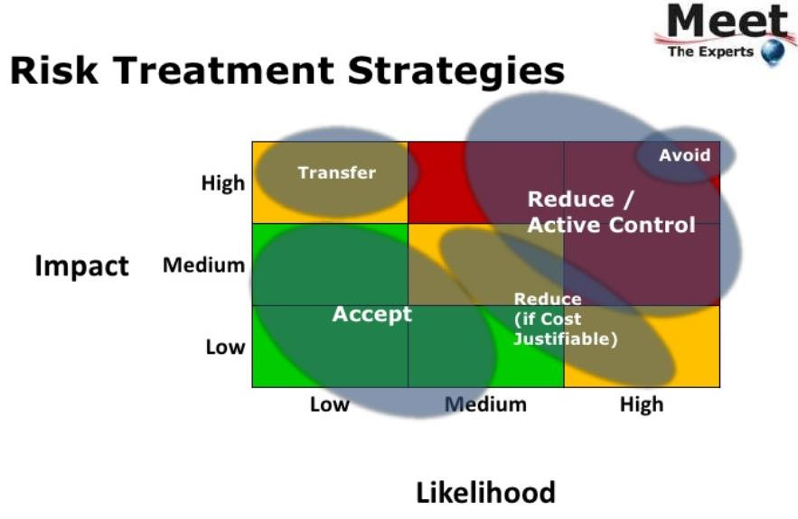

# 3 Asset Management, Risk Management

## ISO 27001, A.8 Asset Management :hammer:

### 8.1 Verantwortlichkeiten für Assets

Ziel: Identifizierung von Firmen Assets und das Festlegen angemessener Schutzmaßnahmen

### 8.2 Information Classification

Ziel: Sicherstellen, dass Informationen angemessenen Schutz erhalten in Bezug auf die Wichtigkeit für das Unternehmen

### 8.3 Media Handling

Ziel: Verhindern, dass Informationen unautorisiert offengelegt, verändert oder zerstört werden

## Information Classification

Typische Einstufungen

| Einstufung | Beschreibung |
| --- | --- |
|Non-Business | Daten ohne Einfluss auf den Unternehmenszweck, Prozesse, Arbeiten, ... |
| Public | Business Informationen die für die Veröffentlichung vorgesehen und klassifiziert sind |
| General | Nicht für Öffentlichkeit gedacht, kann unter Mitarbeitern/ Partnern/ Business Gästen geteilt werden. Standard Einstufung |
|  Confindential | Geheime, strategisch wichtige Informationen, die bei Veröffentlichung Schaden anrichten können. Ebenfalls persönliche Informationen, egal ob bestimmbar |
| Highly Confidential | Sehr sensible Daten und Daten mit hohem Risiko. Höchste Sicherung notwendig. Enthält sensible persönliche identifizierbare Daten |

## ISO 27001, 6.1, 8.2, 8.3 :hammer:

### 8.2 Information security risk assessment

Unternehmen soll Risk Assesments durchführen

### 8.3 Risiko Umgang

Das Unternehmen soll einen Plan zum Umgang mit Risiken einführen

### 6.1 Actions to address risks and opportunities

- InfoSec Management  kann das erwartete Ergbnis erreichen
- Ungewünschte Effekte verhidner oder minimieren
- Andauernde Verbesserung umsetzen

## BSI 200, 8.1 Risk Management, Creating a security Concept :hammer:

- Methodik für Risiko Analyse festlegen
- Risiken und mögliche Schäden klassifizieren
- Risiko Analyse
- Strategie zum Ungang mit Risiken entwickeln
- Sicherheitsmaßnahmen festlegen

## Umgang mit Risiken (ISO 31000/ ISO 27005) :hammer:

- Risiko Modifizierung
- Risiko Zurückhaltung
- Risiko Vermeidung
- Risiko Teilung 

### Brutto Risiko

- Schadensausmaß X Wahrscheinlichkeit
- Schadensausmaß X Häufigkeit des Auftretens

### Präventive Maßnahmen
- Trainiere Mitarbeiter
- Antimalware
- Software up2date
- Manage User Identities

### Reaktive Maßnahmen
- Backup
- Access einschränken (Need to know, Least privilege)

### Risiko Management Prozess 

Schadensausmaß :heavy_plus_sign: EIntrittshäufigkeit :heavy_plus_sign: Ist-Maßnahmen :heavy_plus_sign: Soll-Maßnahmen :arrow_right: Zielrisiko

Schadensausmaß :heavy_plus_sign: Eintrittshäufigkeit :heavy_plus_sign: laufende und Ist-Maßnahmen :arrow_right: Ist-Risiko

Schadensausmaß :heavy_plus_sign: Eintrittshäufigkeit :heavy_plus_sign: Ist-Maßnahmen :arrow_right: Nettp-Risiko

Schadensausmaß :heavy_plus_sign: Eintrittshäufigkeit :arrow_right: Brutto-Risiko
