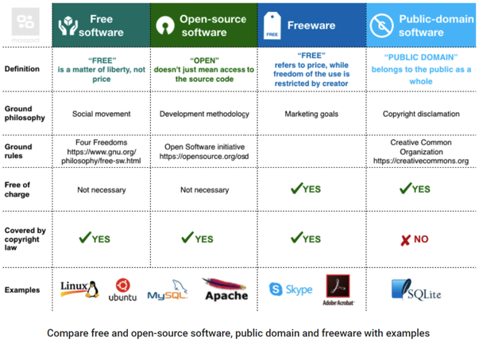
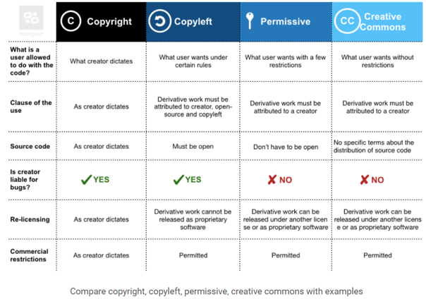
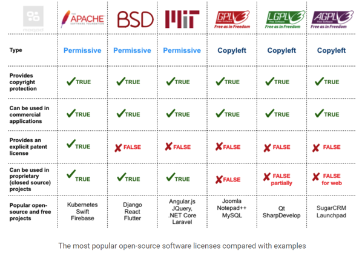

# 5 Rechtliche Lage Deutschland + International + Open Source

## EU Rechtssystem

- Verordnung
  - verbindlicher Rechtsakt
  - Bsp.: EU Importe
- Richtlinien
  - Sache der EU-Länder diese zu verwirklichen
  - Bsp.: EU-Richtlinie Verbraucherrechte
- Beschlüsse
  - verbidnlich und unmittelbar anzuwenden, an den sie gerichtet sind  (Land oder Unternehmen)
  - Bsp.: Terrorismus Bekämpfung

## Internationale Sanktionen

Politische und ökonomische Entscheidung gegen Staaten oder Organisationen mit dem Ziel:

- Schutz nationaler Sicherheit
- Internationales Recht zu schützen
- Verteodigung des internationalen Friedens

## Relevanteste ISO Gesetze

| Gesetz | Beschreibung |
| --- | --- |
| Geschäftsgeheimnisgesetz (GeschGehG)| Sicherung wichtiger Geschäftsinformationen |
| Telekommunikationsgesetz (TKG) | Regulierung des Wettbewerbs im Bereich der Telekommunikation |
| Betriebsverfassungsgesetz (BetrVG) | Gewährleistung von betrieblichen Interessenvertretung von AG und AN |
| BSI-Gesetz | Regelungen in Bezug auf das Bundesamt für Sicherheit in der Informationstechnik |
| Bürgerliches Gesetzbuch (BGB) | Regleung der Rechtsbeziehung zwischen Privatpersonen. Abgrenzung gegenüber dem öffentlichen Recht |
| Strafgesetzbuch (StGB) | Benennung Rechtsordnung, Verhalternsweisen, Strafmaß |

## Geschäftsgeheimnisgesetz :hammer:

### §1 Anwendungsbereich: 
- Schutz unerlaubter Erlangung, Nutzung, Offenlegung
- Öff. Recht. geht vor
- Ausnahmen:
  - Berufs-, Strafrecht
  - Freie Meinungsäußerung
  - Autonomie Sozialpartner
  - Pflichten Arbeitsverhältnis

### §2 Begriffsbestimmung

Geschäftsgeheimnis
- nicht ohne weiteres zugänglich, wirtschaftlicher Wert, nicht allgemein bekannt
- angemessene Geheimhaltungsmaßnahmen
- berechtigtes Interesse an Geheimhaltung

Inhaber: jede nat. oder juristische Person

Rechtsverletzer: jede nat. oder juristische Person

Rechtsverletzendes Produkt: Produkt, dessen Merkmale, Funktionsweise, ... auf rechtswidrig erlangten, genutzten oder offengelegten Geschäftsgeheimnissen beruht

### §3 Erlaubte Handlung

Geschäftsgeheimnis darf erlangt werden durch:

- Eigene Wertschöpfung
- Beobachten, Untersuchen, Testen, ... von Produkt das:
  - öffentlich gemacht wirde
  - sich im Rechtsmäßigen Besitz des Erlangers befindet
- durch Gesetz

### §4 Handlungsverbote

Geschäftsgeheimnis darf nicht erlangt werden durch:

- unbefugtes Aneignen oder Kopieren

Geschäftsgeheimnis darf nicht offenlegen wer:

- Unrechtmäßig erlangt hat
- gegen Verpflichtung der Nutzung des Geheimnisses verstößt
- gegen Verpfichtung verstößt, Geheimnis nicht offenzulegen

Geschäftsgeheimnis darf nicht offengelegt werden, wenn über andere Person erlangt und zzum Zeitpunkt des Erlangens offensichtlich war, dass andere Person Geheimnis entgegen Absatz 22 genutzt oder offengelegt hat.

### §5 Ausnahmen

Durch berechtigtes Interesse:

- Recht freie Meinungsäußerung
- Ausdruck rechtswidrige Handlung
- Arbeitnehmer gegenüber Arbeitnehmervertretung zuur Aufgabenerfüllung (Betriebsrat)

Neuerungen:

- Erforderlichkeit angemessene Geheimhaltungsmaßnahmen zu treffen, damit ein rechtlich geschütztes Geheimnis vorliegt
- das allgemeine öffentliche Interesse zu schützen hebelt GeschGeh aus

## Telekommunikationsgesetz (TKG) :hammer:

### §1 Zweck des Gesetzes

Im Bereich Telekommunikation Wettbewerb fördern und flächendeckend angemessen ausreichene Dienstleistungen zu gewährleisten

### §2 Regulierung, Ziele, Grundsätze

- Regulierung Aufgabe des Bundes
- Zielsetzungen:
  - Fernmeldegehemnis wahren
  - Chancengleichheit und Förderung auf wettbewerbsorientiertem Markt
  - Grundversorung in Stadt und ländlichem Raum sicherstellen
  - Ausbau des Telekommunikationsnetzes mit modernen Technologien
  - Störungsfreiheit bei der Nutzung von Frequenzen sicherstellen (z.B. Überlappungen vermeiden)
  - Wahrung der öffentlichen Sicherheit
  - Wettbewerb zum Nutzen der Verbraucher schützen

### Art 10 GG

Brief-, Post-, und Fernmeldegeheimnis sind unverletzlich
(Einschränkung nur für Wahrung und Schutz demokratischer Werte)

### §88 Fernmeldegeheimnis

- jeder Diensteanbieter ist zur Geheimhaltung verpflichtet
- Es geht um Inhalt der Kommunikation und wer daran beteiligt ist
- Geheimdineste und Ermittlungsbehörden dürfen Überwachen

### §89 Abhörverbot, Geheimhaltungspflicht der Betreiber von Empfangsanlagen

### §90 Missbrauch von Sende- oder sonstigen Telekommunikationsanlagen

- Verbot Sendeanlagen oder Telekommunikationsanlagen zu besitzen, herzustellen, vertreiben, ...

### §148 Strafvorschriften

- Freiheitsstrafen von bis zu 2 Jahren oder Geldstrafe können angesetzt werden
  - Wer abhört
  - Oderr Illegale Anlage besitz
- Bei Fahrlässigkeit bis 1 Jahr oder Geldstrafe

## Telemediengesetz (TMG) :hammer:

### §1 Anwendungsbereich

Gilt für Informations- und Kommunikationsdienste

Grundsätze:

- Eigene Verantwortung der selber gespeicherten Daten
- Keine Pflicht, in Daten nach Rechtsverstößen zu suchen
- Bei rechtlicher Anordnung müssen illegale Inhalte entfernt werden
- Rechtliche Rahmenbedingungen für Telemedien
- Zentrale Vorschrift des Internetrechts
- Copyright oder geistiges Eigentum Inhalt der Daten, kann betroffener Sperrung verlangen

### §8 Durchleitung von Informationen

Diensteanbieter hat keine Verantowrtung über die Daten, solange er diese nicht verändert

### §9 Zwischenspeicherung zur beschleunigten Übermittlung von Informationen

Zwischenspeicherung ist erlaubt, wenn sie dem Zweck dient, Übermittlung fremder Informationen an andere Nutzer effizienter zu gestalten.
Nicht haftbar für Inhalte, so lange sie diese nicht verändert haben

### §10 Speicherung von Informationen

Diensteanbieter sind nicht für Inhalte verantwortlich, sofern keine kenntnis über rechtswidrige Handlungen besteht.

Müssen jedoch Tätig werden, wenn sie über Rechtswidrigkeit informiert werden.

## Betriebsverfassungsgesetz :hammer:

### §87 Mitbestimmungsrechte

Betriebsrat hat Recht mitzubestimmen, wenn Einführung und Anwendung von technischen Einrichtungen, die dazu bestimmt sind, das Verhalten oder die Leistung der Arbeitnehmer zu überwachen, eingeführt werden soll

## BSI Gesetz (BSIG)

### §1 Bundesamt für Sicherheit in der Informationstechnik

Das Bundesamt ist zuständig für die Informationssicherheit auf nationaler Ebene

### §3 Aufgaben des Bundesamtes

- Schutz der Netze des Bundes, Erkennung und Abwehr von Angriffen auf die Regierungsnetze
- Prüfung, Zertifizierung und Akkreditierung von IT-Produkten und -Dienstleistungen
- Warnung vor Schadprogrammen oder Sicherheitslücken in IT-Produkten und -Dienstleistungen
- Sicherheit in der Informationstechnik Kritischer Infrastrukturen

### §3a Verarbeitung personenbezogener Daten

Verarbeitung personenbezogener Daten durch Bundesamt ist zulässig, für öffentl. Interesse Aufgaben notwendig ist.

### §4 Zentrale Meldestelle für die Sicherheit in der Informationstechnik des Bundes

### §5 Abwehr von Schadprogrammen und Gefahren für die Kommunikationstechnik des Bundes

### §8a Sicherheit in der Informationstechnik Kritischer Infrastrukturen

## Bürgerliches Gesetzbuch (BGB) :hammer:

### $826 Sittenwidrige vorsätzliche Schädigung

Wer anderem Schaden zufügt und gegen gute Sitten verstößt, muss Geschädigtem Schadensersatz zahlen

### § 823 Schadensersatzpflicht

## Störerhaftung

Störer ist, wer ohne Täter zu sein, willentlich und adäquat zu Straftat beträgt.
Beispiel: öffentl. WLAN

## Strafgesetzbuch (StGB) :hammer:

### § 201 Verletzung der Vertraulichkeit des Wortes

- Nichtöffentlich Gesprochenes Wort darf nicht aufgenommen werden
- Anhören solcher Aufnahmen
- Verbreiten solcher Aufnahmen ebenfalls verboten

### § 201a Verletzung des höchstpersönlichen Lebensbereichs und von Persönlichkeitsrechten durch Bildaufnahmen

Fotos in Wohnung oder privaten Bereichen (geschütztem Raum) verboten

### § 202 Verletzung des Briefgeheimnisses

### § 202a Ausspähen von Daten

### § 202b Abfangen von Daten

Wie Ausspähen , jedoch unter Anwendung dafür vorgesehener technischer Mittel

### § 202c Vorbereiten des Ausspähens und Abfangens von Daten (Hackerparagraph)

Vorbereitung durch:

- Verschaffen von Passwörtern oder Sicherheitscodes
- Computerprogramme, deren Zweck oben genanntes ist

### § 149 Vorbereitung der Fälschung von Geld und Wertzeichen

### § 202d Datenhehlerei

- Unrechtmäßig erlangt Daten dürfen nicht verkauft werden
- Strafe darf nicht höher ausfallen, als für vorangegangene Tat

### § 303 Sachbeschädigung

### §303a Datenveränderung

### §303b Computersabotage

### § 184 Verbreitung pornographischer Inhalte

### § 184a Verbreitung gewalt- oder tierpornographischer Inhalte

### § 184b Verbreitung, Erwerb und Besitz kinderpornographischer Inhalte

Unter 14 Jahren

### § 184c Verbreitung, Erwerb und Besitz jugendpornographischer Inhalte

## 5 Rechtliche International + Open Source

## NIST 800-171 :hammer:

- Relevant für Zusammenarbeit mit Regierung
- Behandlung von Controlled Unclassified Information (CUI)
  - CUI sind Regierungsdaten
  - Ausreichender Schutz gefordert

## National Defense Authorization Act

Bundesgesetz, das den Haushalt des US Department of Defense bestimmt

Effekte

- Compliance für Geräte bei Geschäften mit US Regierung gefordert

## Was ist OpenSource

Software, die:

- frei verfügbar ist
- änderbar ist

MIT-License: Permissive und Free Software
GNU (General Public License): Copyleft Lizenzen
GNU Lesser General Public License (LGPL): Darf mit Software verlinkt werden, die nicht die GPL Lzenz hat
GNU Affero General Public License: Software die über Netzwerk ausgeführt wird

## OpenSource in Unternehmen

| Pro | Contra |
| --- | --- |
| Keine direkten Lizenzkosten | Lizenzkosten für kommerzielle Nutzung |
| Umfangreiche Dokmentation | Hafung selber |
| Anpassbar | Kein professioneller Support |
| Kein "hidden code" | SLAs fehlen |
| | Kein Product Lifecycle |
