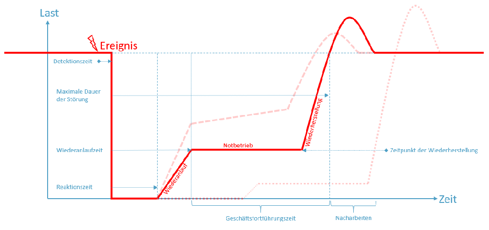

# 6 Zero Trust

## 6.1 Incident Management

## ISO 27001, A.16 InfoSec Incident Management :hammer:

Befasst sich mit dem Managment von Sicherheitsvorfällen

Ziel: Gewährleisten eines effektiven und konsistenten Ansatzes für den Lebenszyklus von Vorfällen, Ereignissen und Schwachstellen

Verantwortlichkeiten :arrow_right: Reporting :arrow_right: Umgang und Behandlung :arrow_right: Lernen :arrow_right: Beweise sammeln

## InfoSec Incident Management (BSI 200, 3, 4, 10.2.2) :hammer:

Informationssicherheit ist in allen Teilbereichen und Projekten integriert

Kommunikation von hoher Wichtigkeit

- Fehlende Kommunikation und Nichtwissen führt zu Sicherheitslücken
Um Konsistenz und Kontionuierlichkeit des gesamten Sicherheitsprozesses zu gewährleisten ist es notwendig, den gesamten Prozess zu dokumentieren.

## Incident Management ISO 27035 :hammer:

### ISO 27035-1

Beschreibt Konzepte und Prinzipien von InfoSec Management

### ISO 27035-2

Beschreibt Richtlinien zur Planung und Vorbereitung für Incident Response

1. InfoSec Policy einführen
2. Policy aktuell halten
3. Incident Management Planung erstellen
4. Incident Repsonse Team aufstellen
5. Technischen Support leisten
6. Awareness und Traings Maßnahmen
7. Testen
8. Lessons learnt

## Was ist ein Informationssicherheitsvorfall

- vermuteter, versuchter, erfolgreicher oder unmittelbar drohender
  - Zugriff
  - unbefugte Nutzung
  - Offenlegung
  - Verletzung
  - Änderung
  - Zerstörung/Löschung

auf/von Informationen oder Störung des IT-Betriebs.

Beispiele:

- Unbefugter Zugriff auf sensitive Unternehmensdaten
- Diebstahl oder Verlust von IT Equipment wie Laptop, Storage Device, ... auf dem potentiell sensitive Daten gespeichert sind

## NIST

1. Preparation
2. Detection and Analysis
3. Containment and Recovery (Eindämmung)
4. Post-Incident-Activty

## SANS (SysAdmin, Audit, Network, Security)

1. Preparation
2. Identification
3. Containment
4. Eradication
5. Recovery
6. Lessons Learned

## NASA

Ähnlich wie SANS

## Locard's Exchange Principle

- Jeder der eine Straftat begeht, hinterlässt eine Spur

## Erkennung eines Sicherheitsvorfalls

- Manuell
- Automatisiert
  - Intrusion Detection and Prevention System
  - SIEM (Security Information an Event Management)
  - Application Specify Alerting

:arrow_right: Itegration des Incident Managements in ServiceDesk

## Honeypot

- Systeme zur Täuschung von Angreifern, um diese von kritischen Systemen abzuwenden und in Honeypot zu locken
- Informationen und Aktivitäten des Angreifers sammeln um diese auswerten zu können
- Angreifer Hinhalten (Beiweissammlung, Rechtliche Schritte einleiten)

**Low Interaction Honeypot**: Simulation und Emulierung von Systemen

**High Interaction Honeypot**: Echte Services, Anwendungen, OS

## 6.2 Business Continuity Management

## InfoSec Incident Management (ISO 27001, A.17) :hammer:

Ziel: Informationssicherheit muss in Business Management Prozess des Unternehmens eingebunden sein

## Incident Management (BSI 200) :hammer:

Schichtenmodell:

- ISMS
- Prozessbausteine
- Systembausteine
  - Systeme
  - Answendungen
  - Netze, Infrastruktur

Ist genutz um spezielle Gefahren und benötigte Herausforderungen gebündelt abzubilden

## Business Continuity Management (ISO 22301)

Ziel: Business muss am Laufen gehalten werden
- Priorität liegt auf Verfübarkeit
- SLAs zu Ausfallzeiten
- 

