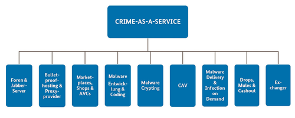

# 7 Attack and Defence Scenarios

## Interne Organisation (ISO 27001, A.6.1.3) :hammer:

- Kontakt zu relevanten Behörden soll gepflegt werden
- Konakt zu Interessensgruppen oder Spezialisten soll gepflegt werden

## Nation-State Attacks

Angriffe die von einer Nation ausgehen, um:

- intellektuelles Eigentum zu stehlen
- zu desinformieren
- Propagana zu verbreiten
- zu infiltrieren

Meist ausgehend in Form von:

- Watering Holes (schadcode auf legitimen Webseiten)
- Phishing
- Zero Day Exploits
- Malware

## Crime as a Service

Cybercrime ist die dynamischste Form von Kriminalität, weil sie sich ständig verändert.

- Eigener Wirtschaftszweig mit eigenen Wertschöpfungsketten
- Professionelle Aufstellung von Angreifern (gut organisiert)
  - Entwicklung
  - Produktmanagement
  - technischer Support
  - Marketing
  - Vertrieb
  - Individuelle Angriffe (high skilled)

### Säule 1 Foren und Jabber Server

- Zentrale Knotenpunkte für Kommunikation krimineller Dienstleistungen (Dark Web)
- Kontaktbörsen (Marketplace)

## §129 StGB Bildung krimineller Vereinigungen :hammer:

- Gründung oder Teilnahme an Unternehmung, deren Zweck auf Begehung von Straftaten ausgerichtet ist

## 100b StGB Online-Durchsuchung :hammer:

- Durchsuchung bei speziellen Anlässen/ Schwere Straftaten erlaubt
- Ohne Wissen des Betroffenen
- Schwere Straftaten:
  - Hochverrat
  - Gelwäsche
  - Mord
  - Sexualstraftaten
  - ...

### Säule 2 Bulletproof-Hosting

- Spezialisierung auf Bereitstellung sicherer Server Infrastrukturen  (IP, Domain, Proxy)
- Zur Verfügugungstellung an kriminelle Kunden gegen Bezahlung
- Diensteanbieter, die zusichern, nicht mit Behörden zusammenzuarbeiten

### Säule 3 Marketplaces, Shops

- Verkauf kompromitierter Zugangsdaten
- Illegale Betäubungsmittel
- Online Zugangsdaten
- Zahlungsdaten
- Waffen

### Säule 4 Malware-Entwicklung

- Entwicklung von Schadsoftware nach Anforderungen des Abnehmers
- Anschließender Verkauf

### Säule 5: Malware-Crypting

- Entwicklung von gut getarnter Malware, durch Verschlüsselung oder Verfremdung des Codes
- Sollen nicht erkannt werden

### Säule 6: Counter Antivirus-Service

- Test von Malware mit AV-Programmen auf Detektierbarkeit

### Säule 7: Malware Delivery/Infection on Demand

- Spezialisiert auf Verbreitung und Installation von Schadsoftware
  - Nutzung von Botnetzen
  - Pay-per-Install

### Säule 8: Drops, Mules und Cashout

- Verwirklichung des Monetären Mehrwerts
- Zustellung von illegalen Waren

### Säule 9: Exchanger

- Geldwäsche im digitalen Raum
- Verschleierung von Zahlungen

## Top 3 Tatmittel im Internet

1. Vermögens- und Fälschungsdelikte
2. Sonstige
3. Straftaten gegen sexuelle Bestimmung

## MITRE ATT&CK Framework

- Dokumentieren von Angriffstaktiken basierend auf realen Beobachtungen
- Index entwickelt sich passend zum Bedrohungsumfeld

Ziel: Angriffsmodelle, Methoden und Risikominderung zu verstehen

Tactics :arrow_right: Gründe für Angriff erfragen
Techniques :arrow_right: wie wurde vorgegangen
Sub-Techniques :arrow_right: spezifische Beschreibung